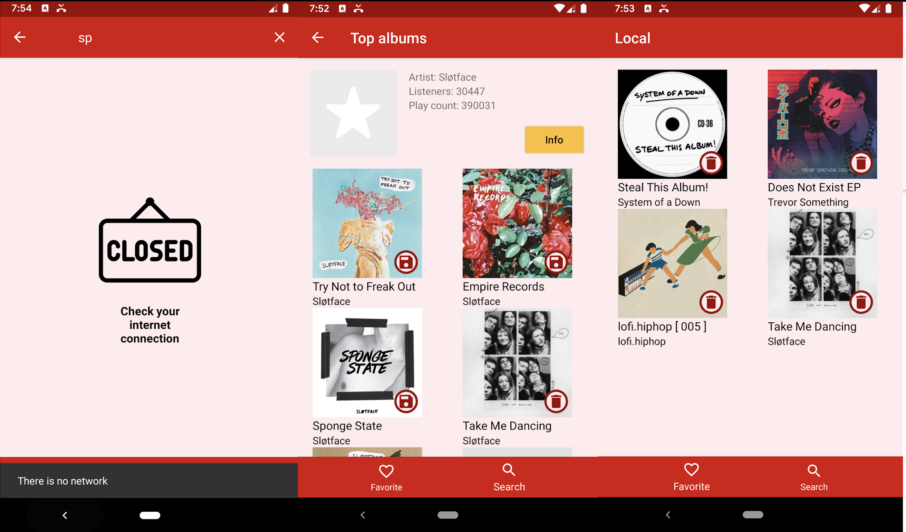

# LastFM.AF

**Simple app to browse albums on Last.FM**

*To build project you need to:*

- Create your API key on the following website:
https://www.last.fm/api/authentication
- Copy created `API key`
- Go to gradle.properties file and create project property with name `API_KEY` with value of your generated API-key
- Build project :)

*Used libraries:*

- Retrofit;
- Kotlin Coroutines;
- Room Persistence Library;
- ViewModels & LiveData;
- Jetpack Navigation;
- Koin.
